<!-- Banner animado -->

  

<!-- Subtítulo con efecto de escritura -->

  

---

### 🚀 Sobre mí

- 🔭 Trabajando en **[Lendex](https://lendexgp.com/landing)** — proyecto propio.
- 💻 Full Stack Developer.
- 🌱 Siempre aprendiendo algo nuevo.

---

### 🧰 Stack & Herramientas

  
  
  
  
  
  
  
  
  
  

---

### 📊 Mis estadísticas

<!-- Generadas por GitHub Actions (.github/workflows/metrics.yml) y guardadas
     en este mismo repo, asi nunca fallan por limite de API de terceros. -->

  

  

  

---

### 🌐 Conéctate conmigo

  
  
  <!-- Agrega tus redes reales:
  
  -->

  

  

